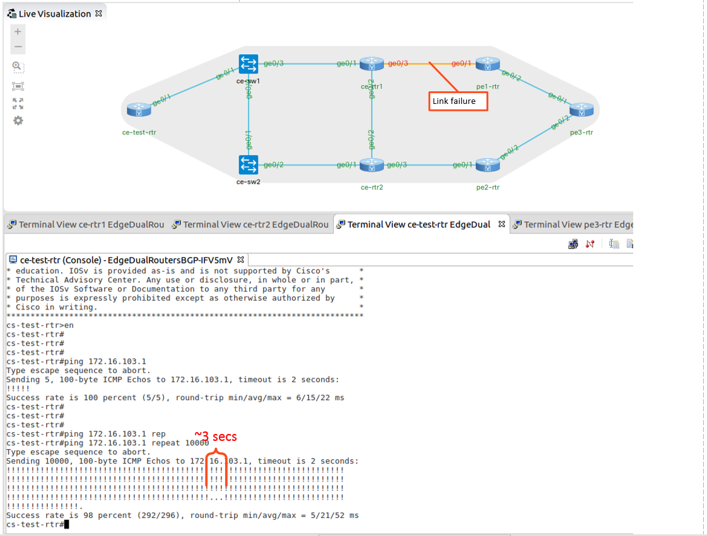

# Cisco / Resilient Enterprise Router Edge

## Overview

In this recipe, we enable a resilent enterprise edge with dual routers, two network providers and eBGP. In this example we will test the most common failure scenarios and provide debugging.

In our examples the path from the client to test IP on pe3-rtr loopback address 172.16.103.1 traceroute

```
cs-test-rtr#traceroute 172.16.103.1
Type escape sequence to abort.
Tracing the route to 172.16.103.1
VRF info: (vrf in name/id, vrf out name/id)
  1 10.1.0.2 15 msec 15 msec 22 msec
  2 192.168.255.2 39 msec 24 msec 13 msec
  3 192.168.255.9 33 msec 26 msec *
```

## Topology

In this first scenario we will provide a diagram of the lab along with the link failure example. Approximately 3 seconds of packet loss while BGP recovers from the failure. NOTE - no BFD configured.



### Scenario 1: Provider Link Failure

Debug for link failure

```
*Oct 25 04:22:45.768: %LINEPROTO-5-UPDOWN: Line protocol on Interface GigabitEthernet0/3, changed state to down
*Oct 25 04:22:46.768: %LINK-3-UPDOWN: Interface GigabitEthernet0/3, changed state to down
*Oct 25 04:22:46.778: is_up: GigabitEthernet0/3 0 state: 0 sub state: 1 line: 0
*Oct 25 04:22:46.779: %BGP-5-NBR_RESET: Neighbor 192.168.255.2 reset (Interface flap)
*Oct 25 04:22:46.781: RT: interface GigabitEthernet0/3 removed from routing table
*Oct 25 04:22:46.782: RT: del 192.168.255.0 via 0.0.0.0, connected metric [0/0]
*Oct 25 04:22:46.783: RT: delete subnet route to 192.168.255.0/30
*Oct 25 04:22:46.785: RT: del 192.168.255.1 via 0.0.0.0, connected metric [0/0]
*Oct 25 04:22:46.786: RT: delete subnet route to 192.168.255.1/32
*Oct 25 04:22:46.798: BGP: tbl IPv4 Unicast:base Service reset requests
*Oct 25 04:22:46.802: BGP: tbl IPv4 Multicast:base Service reset requests
*Oct 25 04:22:46.803: BGP: tbl L2VPN E-VPN:base Service reset requests
*Oct 25 04:22:46.804: BGP: tbl MVPNv4 Unicast:base Service reset requests
*Oct 25 04:22:46.810: BGP: 192.168.255.2 reset due to Interface flap
*Oct 25 04:22:46.810: %BGP-5-ADJCHANGE: neighbor 192.168.255.2 Down Interface flap
*Oct 25 04:22:46.811: %BGP_SESSION-5-ADJCHANGE: neighbor 192.168.255.2 IPv4 Unicast topology base removed from session  Interface flap
*Oct 25 04:22:46.812: RT: updating bgp 172.16.103.0/24 (0x0)  :
    via 10.1.255.102   0 1048577

*Oct 25 04:22:46.813: RT: closer admin distance for 172.16.103.0, flushing 1 routes
*Oct 25 04:22:46.815: RT: add 172.16.103.0/24 via 10.1.255.102, bgp metric [200/0]
*Oct 25 04:22:46.832: BGP: bgp_rwatch_notify: BGP_RWATCH_APPL_NHOP
*Oct 25 04:22:46.833: EvD: charge penalty 500, new accum. penalty 500, flap count 9
*Oct 25 04:22:46.834: BGP: bgp_rwatch_notify: BGP_RWATCH_APPL_NBR
*Oct 25 04:22:46.835: BGP: nbr global 192.168.255.2 bgp_process_bnbr_notification not reachable
```

New path via ce-rtr2

```
cs-test-rtr#traceroute 172.16.103.1
Type escape sequence to abort.
Tracing the route to 172.16.103.1
VRF info: (vrf in name/id, vrf out name/id)
  1 10.1.0.2 14 msec 22 msec 19 msec
  2 10.1.255.2 19 msec 15 msec 6 msec
  3 192.168.255.6 10 msec 17 msec 7 msec
  4 192.168.255.13 12 msec 30 msec *
```

### Scenario 2: Provider Soft Failure

In this scenario we will apply a deny-all access list to the eBGP peer interface to simulate a soft link failure. Approximately 1 seconds of packet loss while BGP recovers from the failure. NOTE - BFD configured. You can see the BFD alerts in the debug log.

```
cs-test-rtr#ping 172.16.103.1 repeat 100000
Type escape sequence to abort.
Sending 100000, 100-byte ICMP Echos to 172.16.103.1, timeout is 2 seconds:
!!!!!!!!!!!!!!!!!!!!!!!!!!!!!!!!!!!!!!!!!!!!!!!!!!!!!!!!!!!!!!!!!!!!!!
!!!!!!!!!!!!!!!!!!!!!!!!!!!!!!!!!!!!!!!!!!!!!!!!!!!!!!!!!!!!!!!!!!!!!!
!!!!!!!!!!!!!!!!!!!!!!!!!!!!!!!!!!!!!!!!!!!!!!!!!!!!!!!!!!!!!!!!!!!!!!
!!!!!!!!!!!!!!!!!!!!!!!!!!!!!!!!!!!!!!!!!!!!!!!!!!!!!!!!!!!!!!!.!!!!!!
!!!!!!!!!!!!!!!!!!!!!!!!!!!!!!!!!!!!!!!!!!!!!!!!!!!!!!!!!!!!!!!!!.
Success rate is 99 percent (344/346), round-trip min/avg/max = 5/21/52 ms
```

Debug for soft link failure

```
*Oct 25 04:44:56.947: %BFDFSM-6-BFD_SESS_DOWN: BFD-SYSLOG: BFD session ld:1 handle:1,is going Down Reason: ECHO FAILURE
*Oct 25 04:44:56.952: %BGP-5-NBR_RESET: Neighbor 192.168.255.2 reset (BFD adjacency down)
*Oct 25 04:44:56.956: BGP: tbl IPv4 Unicast:base Service reset requests
*Oct 25 04:44:56.957: BGP: tbl IPv4 Multicast:base Service reset requests
*Oct 25 04:44:56.958: BGP: tbl L2VPN E-VPN:base Service reset requests
*Oct 25 04:44:56.959: BGP: tbl MVPNv4 Unicast:base Service reset requests
*Oct 25 04:44:56.965: BGP: 192.168.255.2 reset due to BFD adjacency down
*Oct 25 04:44:56.966: %BGP-5-ADJCHANGE: neighbor 192.168.255.2 Down BFD adjacency down
*Oct 25 04:44:56.966: %BGP_SESSION-5-ADJCHANGE: neighbor 192.168.255.2 IPv4 Unicast topology base removed from session  BFD adjacency down
*Oct 25 04:44:56.969: %BFD-6-BFD_SESS_DESTROYED: BFD-SYSLOG: bfd_session_destroyed,  ld:1 neigh proc:BGP, handle:1 act
*Oct 25 04:44:56.970: RT: updating bgp 172.16.103.0/24 (0x0)  :
    via 10.1.255.102   0 1048577

*Oct 25 04:44:56.972: RT: closer admin distance for 172.16.103.0, flushing 1 routes
*Oct 25 04:44:56.973: RT: add 172.16.103.0/24 via 10.1.255.102, bgp metric [200/0]
```

### Scenario 3: Customer Router Failure

In this scenario we will shutdown ce-rtr1. HSRP will state change to provide a resilient first hop default router for the customer LAN. We observe approximately 5 seconds of loss due to eBGP convergence. 

```
cs-test-rtr#ping 172.16.103.1 repeat 10000
Type escape sequence to abort.
Sending 10000, 100-byte ICMP Echos to 172.16.103.1, timeout is 2 seconds:
!!!!!!!!!!!!!!!!!!!!!!!!!!!!!!!!!!!!!!!!!!!!!!!!!!!!!!!!!!!!!!!!!!!!!!
!!!!!!!!!!!!!!!!!!!!!!!!!!!!!!!!!!!!!!!!!!!!!!!!!!!!!!!!!!!!!!!!!!!!!!
!!!!!!!!!!!!!!!!!!!!!!!!!!!!!!!!!!!!!!!!!!!!!!!!!!!!!!!!!!!!!!!!!!!!!!
!!!!!!!!!!!!!!!!!!!!!!!!!!!!!!!!!!!!!!!!!!!!!!!!!!!!!!!!!!!!!!!!!!!!!!
!!!!!!!!!!!!!!!!!!!!!!!!!!!!!!!!!!!!!!!!!!!!!!!!!!!!!!!!!!!!!!!!.....!
!!!!!!!!!!!!!!!!!!!!!!!!!!!!!!!!!!!!!!!!!!!!!!!!!!!!!!!
Success rate is 98 percent (400/405), round-trip min/avg/max = 5/24/77 ms
cs-test-rtr#
```

Debug for ce-rtr2 failure

```
ce-rtr2#
*Oct 25 04:52:46.981: %HSRP-5-STATECHANGE: GigabitEthernet0/1 Grp 10 state Standby -> Active
*Oct 25 04:53:02.938: BGP: Regular scanner timer event
*Oct 25 04:53:02.939: BGP: Performing BGP general scanning
*Oct 25 04:53:02.939: BGP: tbl IPv4 Unicast:base Performing BGP Nexthop scanning for general scan
*Oct 25 04:53:02.940: BGP(0): Future scanner version: 118, current scanner version: 117
*Oct 25 04:53:02.940: BGP: tbl IPv4 Multicast:base Performing BGP Nexthop scanning for general scan
*Oct 25 04:53:02.941: BGP(6): Future scanner version: 121, current scanner version: 120
*Oct 25 04:53:02.941: BGP: tbl L2VPN E-VPN:base Performing BGP Nexthop scanning for general scan
*Oct 25 04:53:02.942: BGP(10): Future scanner version: 121, current scanner version: 120
*Oct 25 04:53:02.942: BGP: tbl MVPNv4 Unicast:base Performing BGP Nexthop scanning for general scan
*Oct 25 04:53:02.944: BGP(15): Future scanner version: 121, current scanner version: 120
*Oct 25 04:53:17.956: %OSPF-5-ADJCHG: Process 10, Nbr 10.1.255.101 on GigabitEthernet0/2 from FULL to DOWN, Neighbor Down: Dead timer expired
*Oct 25 04:53:23.463: RT: del 10.1.255.101 via 10.1.255.1, ospf metric [110/2]
*Oct 25 04:53:23.465: RT: delete subnet route to 10.1.255.101/32
```

### Configurations

**ce-rtr1**

```
! Last configuration change at 05:42:43 UTC Thu Oct 25 2018
!
version 15.6
service timestamps debug datetime msec
service timestamps log datetime msec
no service password-encryption
!
hostname ce-rtr1
!
boot-start-marker
boot-end-marker
!
!
!
aaa new-model
!
!
!
!
!
!
!
aaa session-id common
!
!
!
mmi polling-interval 60
no mmi auto-configure
no mmi pvc
mmi snmp-timeout 180
!
!
!
!
!
!
!
!
!
!
!
ip domain name e.com
ip cef
no ipv6 cef
!
multilink bundle-name authenticated
!
!
!
!
!
redundancy
!
!
! 
!
!
!
!
!
!
!
!
!
!
!
interface Loopback0
 ip address 10.1.255.101 255.255.255.255
!
interface GigabitEthernet0/0
 ip address 10.255.0.188 255.255.0.0
 duplex auto
 speed auto
 media-type rj45
!
interface GigabitEthernet0/1
 ip address 10.1.0.2 255.255.255.0
 standby 10 ip 10.1.0.1
 standby 10 priority 255
 duplex auto
 speed auto
 media-type rj45
!
interface GigabitEthernet0/2
 ip address 10.1.255.1 255.255.255.252
 duplex auto
 speed auto
 media-type rj45
 bfd interval 50 min_rx 50 multiplier 5
!
interface GigabitEthernet0/3
 ip address 192.168.255.1 255.255.255.252
 duplex auto
 speed auto
 media-type rj45
 bfd interval 50 min_rx 50 multiplier 5
!
router ospf 10
 router-id 10.1.255.101
 network 10.1.255.0 0.0.0.255 area 0
!
router bgp 65000
 bgp log-neighbor-changes
 network 10.1.0.0 mask 255.255.255.0
 neighbor 10.1.255.102 remote-as 65000
 neighbor 10.1.255.102 update-source Loopback0
 neighbor 10.1.255.102 fall-over bfd
 neighbor 10.1.255.102 next-hop-self
 neighbor 10.1.255.102 soft-reconfiguration inbound
 neighbor 192.168.255.2 remote-as 65001
 neighbor 192.168.255.2 fall-over bfd
 neighbor 192.168.255.2 soft-reconfiguration inbound
 neighbor 192.168.255.2 filter-list 10 out
!
ip forward-protocol nd
!
ip as-path access-list 10 permit ^$
!
no ip http server
no ip http secure-server
ip route 10.1.0.0 255.255.255.0 Null0 255
ip ssh server algorithm encryption aes128-ctr aes192-ctr aes256-ctr
ip ssh client algorithm encryption aes128-ctr aes192-ctr aes256-ctr
!
ipv6 ioam timestamp
!
route-map PREPEND permit 10
 set as-path prepend 65000
```

**ce-rtr2**

```
! Last configuration change at 05:49:06 UTC Thu Oct 25 2018
!
version 15.6
service timestamps debug datetime msec
service timestamps log datetime msec
no service password-encryption
!
hostname ce-rtr2
!
boot-start-marker
boot-end-marker
!
!
!
aaa new-model
!
!
!
!
!
!
!
aaa session-id common
!
!
!
mmi polling-interval 60
no mmi auto-configure
no mmi pvc
mmi snmp-timeout 180
!
!
!
!
!
!
!
!
!
!
!
ip domain name e.com
ip cef
no ipv6 cef
!
multilink bundle-name authenticated
!
!
!
!
redundancy
!
!
! 
!
!
!
!
!
!
!
!
!
!
!
interface Loopback0
 ip address 10.1.255.102 255.255.255.255
!
interface GigabitEthernet0/0
 ip address 10.255.0.189 255.255.0.0
 duplex auto
 speed auto
 media-type rj45
!
interface GigabitEthernet0/1
 ip address 10.1.0.3 255.255.255.0
 standby 10 ip 10.1.0.1
 duplex auto
 speed auto
 media-type rj45
!
interface GigabitEthernet0/2
 ip address 10.1.255.2 255.255.255.252
 duplex auto
 speed auto
 media-type rj45
 bfd interval 50 min_rx 50 multiplier 5
!
interface GigabitEthernet0/3
 ip address 192.168.255.5 255.255.255.252
 duplex auto
 speed auto
 media-type rj45
 bfd interval 50 min_rx 50 multiplier 5
!
router ospf 10
 router-id 10.1.255.102
 network 10.1.255.0 0.0.0.255 area 0
!
router bgp 65000
 bgp log-neighbor-changes
 network 10.1.0.0 mask 255.255.255.0
 neighbor 10.1.255.101 remote-as 65000
 neighbor 10.1.255.101 update-source Loopback0
 neighbor 10.1.255.101 fall-over bfd
 neighbor 10.1.255.101 next-hop-self
 neighbor 10.1.255.101 soft-reconfiguration inbound
 neighbor 192.168.255.6 remote-as 65002
 neighbor 192.168.255.6 fall-over bfd
 neighbor 192.168.255.6 soft-reconfiguration inbound
 neighbor 192.168.255.6 filter-list 10 out
!
ip forward-protocol nd
!
ip as-path access-list 10 permit ^$
!
no ip http server
no ip http secure-server
ip route 10.1.0.0 255.255.255.0 Null0 255
ip ssh server algorithm encryption aes128-ctr aes192-ctr aes256-ctr
ip ssh client algorithm encryption aes128-ctr aes192-ctr aes256-ctr
!
!
ip prefix-list PREFIX-LIST seq 5 permit 172.16.103.0/24
ipv6 ioam timestamp
!
route-map SET-LOCAL-PREF permit 10
 match ip address prefix-list PREFIX-LIST
 set local-preference 200
!
route-map SET-LOCAL-PREF permit 20
!
route-map PREPEND permit 10
 set as-path prepend 65000 65000
```


