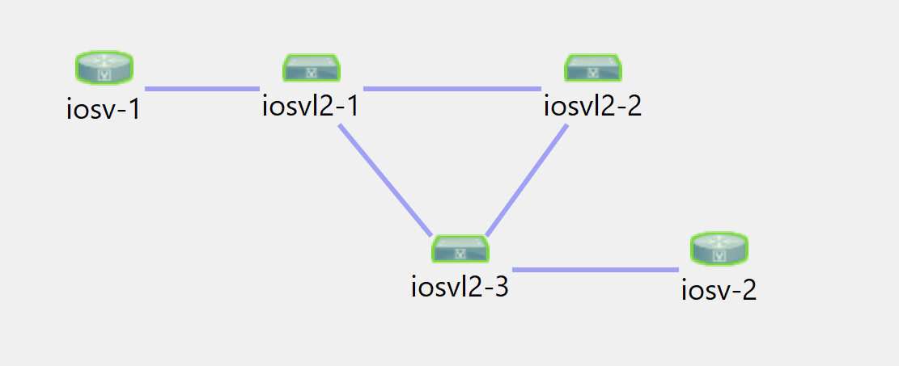
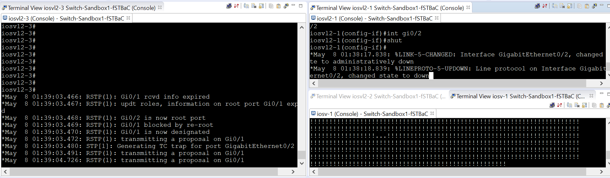

# Cisco Resilient LAN

**Table of contents**
* [Overview](#overview)
* [Topology](#topology)
* [Configurations](#configurations)

## Overview

Simple design that shows the use of rapid spanning-tree and the appropriate configurations to optimize path resiliency and fast reconvergence. 

## Topology

## Configuration

* The global command `spanning-tree mode rapid-pvst` on every switch in the fabric enabled rapid spanning tree.
* The port command `spanning-tree portfast edge` on every edge port or you can enable the global command `spanning-tree portfast edge default`.

## Results

In the screen shot, we see that we shutdown the link between `iosvl2-1` and `iosvl2-3`. The results are 2 to 3 seconds of loss due to rapid spanning tree convergence. 

## Configurations

* [iosvl2-1](./iosvl2-1.cfg)
* [iosvl2-2](./iosvl2-2.cfg)
* [iosvl2-3](./iosvl2-3.cfg)
